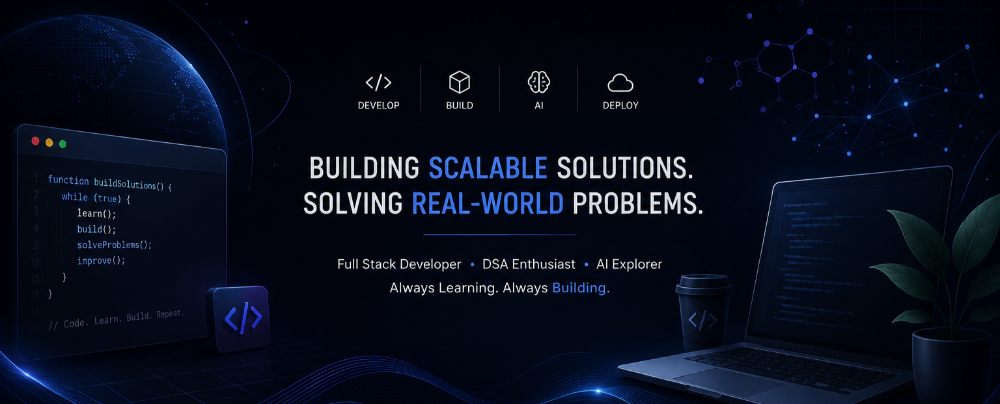

  

  
<h1 align="center">Hey, I'm Yash👋</h1>

I am a passionate B.Tech student focused on Full Stack Development, Competitive Programming, and Generative AI.
I enjoy building real-world applications, solving algorithmic problems, and continuously learning modern technologies.

---

<h1 align="center">Currently Working On</h1>

- 🤖 Learning Generative AI & LLMs
- ⚛️ Building scalable Full Stack applications
- 💻 Solving DSA problems daily
- 🌱 Contributing to open source
---

---

<h1 align="center">Tech Stack</h1>

<h2 align="center" style="color: #3B82F6;">
  
  Languages
</h2>

  
  
  
  
  

<h2 align="center" style="color:rgb(185, 185, 16);">🧩Frameworks </h2>

  
  
  
  
  

<h2 align="center" style="color:rgb(230, 55, 55);">📚 Libraries & Databases</h2>

  
  
  

<h2 align="center" style="color:rgb(230, 55, 55);">⚙️ Tools</h2>

  
  

---

## 🏆 Coding Profiles

  

  
  
  

 
  

---
## 📫 Connect With Me

 ⭐ <b>Code • Learn • Build • Repeat</b> ⭐ 

  

